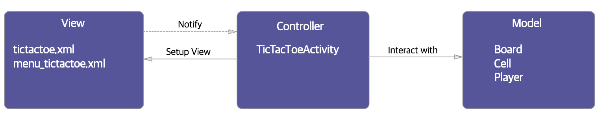
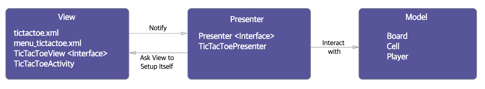

### MVC

모델,뷰,컨트롤러 접근 방식은 어플리케이션을 세 가지 책임 집합으로 분리합니다.

### 모델(Model)

앱의 데이터 + 상태 + 비즈니스 로직. 앱의 두뇌 역할 뷰나 컨트롤러에 묶이지 않으므로 많은곳에서 재사용 가능

뷰(View)

뷰는 모델의 표현입니다. UI를 그리고 사용자가 앱과 상호작용할 때 컨트롤러와 통신하는 책임을 맡습니다. MVC 구조에서는 뷰는 하위 모델에 대한 지식이나 상태에 대한 이해가 없고 사용자가 버튼을 클릭하거나 값을 알려주는 행동을 할 때 무엇을 해야 할지 모르므로 상당히 "멍청"하다고 표현가능. 뷰가 덜 알 수록 모델에 종혹속되지 않으므로 변화에 유현

컨트롤러(Controller)

앱을 묶어주는 접착제. 어플리케이션에서 발생하는 일을 담당하는 마스터 컨트롤러 역할. 뷰가 컨트롤러에게 사용자가 버튼을 눌렀다고 알리면 컨트롤러는 그에 따라 어떻게 모델과 상호작용 할지 결정. 안드로이드 앱에서는 컨트롤러가 주로 액티비티나 프래그먼트로 표현



```java
public class TicTacToeActivity extends AppCompatActivity {

    private Board model;

    /* View Components referenced by the controller */
    private ViewGroup buttonGrid;
    private View winnerPlayerViewGroup;
    private TextView winnerPlayerLabel;

    /**
     * In onCreate of the Activity we lookup & retain references to view components
     * and instantiate the model.
     */
    @Override
    protected void onCreate(Bundle savedInstanceState) {
        super.onCreate(savedInstanceState);
        setContentView(R.layout.tictactoe);
        winnerPlayerLabel = (TextView) findViewById(R.id.winnerPlayerLabel);
        winnerPlayerViewGroup = findViewById(R.id.winnerPlayerViewGroup);
        buttonGrid = (ViewGroup) findViewById(R.id.buttonGrid);

        model = new Board();
    }

    /**
     * Here we inflate and attach our reset button in the menu.
     */
    @Override
    public boolean onCreateOptionsMenu(Menu menu) {
        MenuInflater inflater = getMenuInflater();
        inflater.inflate(R.menu.menu_tictactoe, menu);
        return true;
    }
    /**
     *  We tie the reset() action to the reset tap event.
     */
    @Override
    public boolean onOptionsItemSelected(MenuItem item) {
        switch (item.getItemId()) {
            case R.id.action_reset:
                reset();
                return true;
            default:
                return super.onOptionsItemSelected(item);
        }
    }

    /**
     *  When the view tells us a cell is clicked in the tic tac toe board,
     *  this method will fire. We update the model and then interrogate it's state
     *  to decide how to proceed.  If X or O won with this move, update the view
     *  to display this and otherwise mark the cell that was clicked.
     */
    public void onCellClicked(View v) {

        Button button = (Button) v;

        int row = Integer.valueOf(tag.substring(0,1));
        int col = Integer.valueOf(tag.substring(1,2));

        Player playerThatMoved = model.mark(row, col);

        if(playerThatMoved != null) {
            button.setText(playerThatMoved.toString());
            if (model.getWinner() != null) {
                winnerPlayerLabel.setText(playerThatMoved.toString());
                winnerPlayerViewGroup.setVisibility(View.VISIBLE);
            }
        }

    }

    /**
     * On reset, we clear the winner label and hide it, then clear out each button.
     * We also tell the model to reset (restart) it's state.
     */
    private void reset() {
        winnerPlayerViewGroup.setVisibility(View.GONE);
        winnerPlayerLabel.setText("");

        model.restart();

        for( int i = 0; i < buttonGrid.getChildCount(); i++ ) {
            ((Button) buttonGrid.getChildAt(i)).setText("");
        }
    }
}
```

### 평가

MVC는 훌륭하게 모델과 뷰를 분리해줍니다. 모델이 어디에도 종속되지 않으며, 뷰는 유닛 테스트 레벨에서 그다지 테스트할 것이 거의 없어서 쉽게 모델을 테스트할 수 있습니다. 하지만 컨트롤러에 몇 가지 문제점이 존재합니다.

#### 컨트롤러 문제점

- *테스트 용이성* - 컨트롤러가 안드로이드 API에 깊게 종속되므로 유닛 테스트가 어렵습니다.
- *모듈화 및 유연성* - 컨트롤러가 뷰에 단단히 결합되며, 뷰의 확장일 수도 있습니다. 뷰를 변경하면 컨트롤러로 돌아가서 변경해야 합니다.
- *유지 보수* - 시간이 지남에 따라 보다 많은 코드가 컨트롤러로 모이면서 비대해지고 문제가 발생하기 쉬워집니다. 특히 [anemic models](https://martinfowler.com/bliki/AnemicDomainModel.html) 모델을 사용하는 앱에서라면 더욱 그렇습니다.

어떻게 이런 문제를 해결할 수 있을까요? MVP가 해결책이 될 수 있을까요?

### MVP

MVP는 컨트롤러의 책임에 묶이지 않고도 뷰와 액티비티가 자연스럽게 결합하도록 합니다. 더 자세한 내용은 이후에 다루도록 하고, 먼저 MVC와 대비되는 공통 책임 정의부터 시작하겠습니다.

#### 모델(Model)

MVC와 동일하며 변화가 없습니다.

#### 뷰(View)

유일한 변화는 액티비티/프래그먼트가 이제 뷰의 일부로 간주된다는 것입니다. 따라서 이들이 서로에게 연관되는 자연스러운 현상을 극복할 필요가 없습니다. 액티비티가 뷰 인터페이스를 구현해서 프리젠터가 코드를 만들 인터페이스를 갖도록 하는 것이 좋습니다. 이렇게 하면 특정 뷰와 결합되지 않고 가상 뷰를 구현해서 간단한 유닛 테스트를 실행할 수 있죠.

#### 프리젠터(Presenter)

본질적으로는 MVC의 컨트롤러와 같지만, 뷰에 연결되는 것이 아니라 그냥 인터페이스라는 점이 다릅니다. 이에 따라 MVC가 가진 테스트 가능성 문제와 함께 모듈화/유연성 문제 역시 해결합니다. *사실 극단적으로 MVP를 따르는 사람들은 프리젠터가 절대로 어떤 안드로이드 API나 코드라도 참조해서는 안된다고 주장합니다.*



아래 코드에서 프리젠터를 살펴보면, 각 행동의 의도가 더 단순하고 명확해진 것을 볼 수 있습니다. **뷰에게 무언가를 표시하는 방법을 지시하는 대신, 표시할 내용만 전달합니다.**

```java
public class TicTacToePresenter implements Presenter {

    private TicTacToeView view;
    private Board model;

    public TicTacToePresenter(TicTacToeView view) {
        this.view = view;
        this.model = new Board();
    }

    // Here we implement delegate methods for the standard Android Activity Lifecycle.
    // These methods are defined in the Presenter interface that we are implementing.
    public void onCreate() { model = new Board(); }
    public void onPause() { }
    public void onResume() { }
    public void onDestroy() { }

    /** 
     * When the user selects a cell, our presenter only hears about
     * what was (row, col) pressed, it's up to the view now to determine that from
     * the Button that was pressed.
     */
    public void onButtonSelected(int row, int col) {
        Player playerThatMoved = model.mark(row, col);

        if(playerThatMoved != null) {
            view.setButtonText(row, col, playerThatMoved.toString());

            if (model.getWinner() != null) {
                view.showWinner(playerThatMoved.toString());
            }
        }
    }

    /**
     *  When we need to reset, we just dictate what to do.
     */
    public void onResetSelected() {
        view.clearWinnerDisplay();
        view.clearButtons();
        model.restart();
    }
}
```

액티비티를 프레젠터에 묶지 않고 이작업을 수행하기위해서는 액티비티가 구현할 인터페이스를 생성해야합니다.

```java
public interface TicTacToeView {
    void showWinner(String winningPlayerDisplayLabel);
    void clearWinnerDisplay();
    void clearButtons();
    void setButtonText(int row, int col, String text);
}
```

#### 평가

MVC 보다 깔끔한 형태입니다. 안드로이드 고유의 뷰와 API에 연결되지 않으므로 ***TicTacToeView***인터페이스를 구현했다면 어떤 뷰와도 작업할 수 있어서 프리젠터 로직을 쉽게 테스트할 수 있습니다.

#### 프리젠터 문제점

- *유지 보수* - 컨트롤러처럼 프리젠터에도 시간이 지남에 따라 추가 비즈니스 로직이 모이는 경향이 있습니다. 시간이 흐른 후 개발자는 거대하고 다루기 어려운데다 문제가 발생하기 쉽고 분리하기도 어려운 프리젠터를 발견하게 돼죠.

물론 신중한 개발자라면 세월에 따른 앱의 변화에 맞춰 이 문제를 지속적으로 해결해나갈 수 있을 겁니다. 하지만 MVVM은 시작할 때부터 이 문제를 해결하도록 도움을 줄 수 있습니다.

